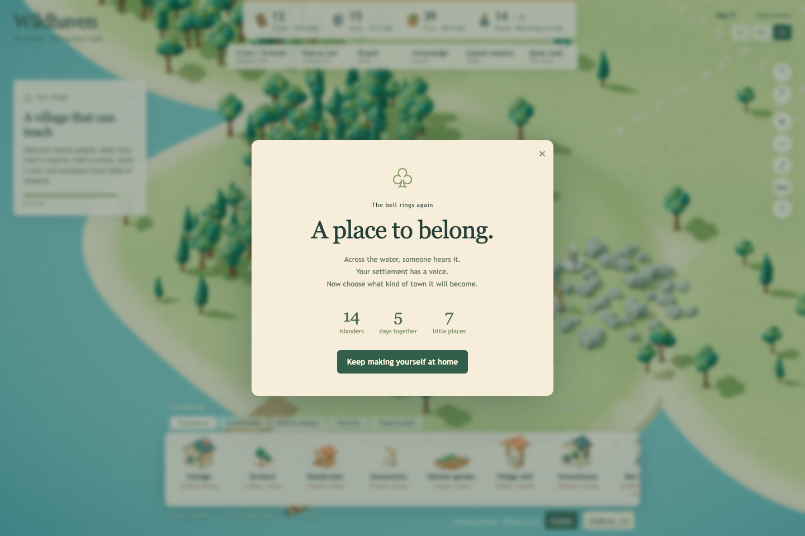
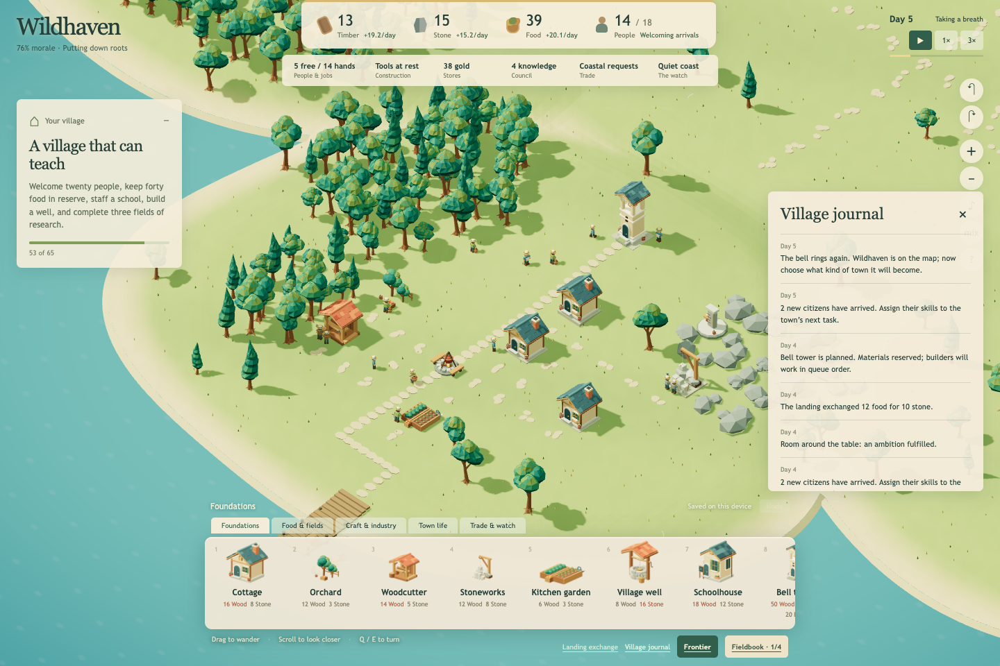
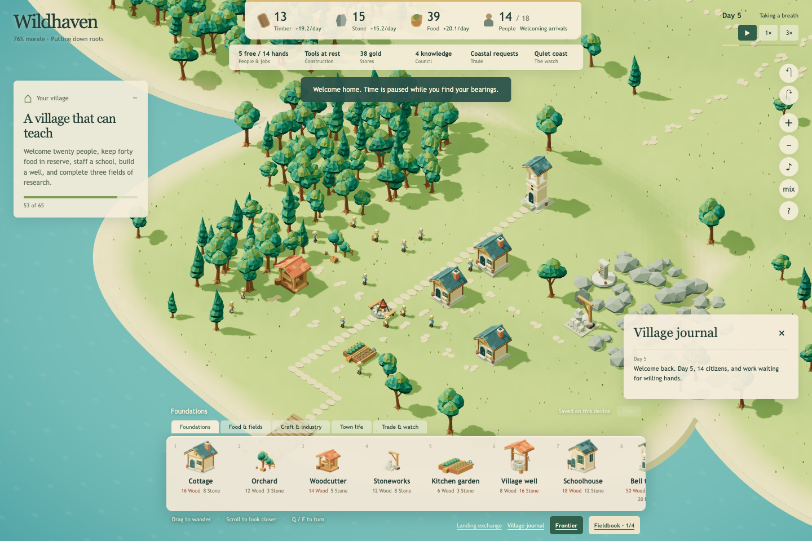

# Wildhaven — first-bell playthrough and polish assessment

October 6, 2026, America/New_York. Assessed the published Wildhaven v4 at `c3bbc7a03f86ca4de76d23b36d1dad1adc2a49a8` (PR151), not the legacy Realm Canvas2D game. No gameplay code, deployment or player save was changed.

## Result

Played from six founders through the first bell on Day 5 with fourteen residents. Built three cottages, an orchard, a kitchen garden, a woodcutter and stoneworks; changed workforce requests; traded surplus food for stone; delivered a coastal food order; sent Finn to survey the mason’s waystone and commissioned its restoration. Finn returned with the story and then the permanent 10% construction benefit. Resumed the village during paid fieldwork and again after the bell.

The core pleasure is already present: giving named people jobs, seeing the work take shape, and discovering something that improves the village. The next pass should improve continuity and readability around those moments. More systems or a new art direction are not the immediate need.

The first bell took about 377 simulated seconds using the ordinary 1× and 3× controls; the final motion inspection ended at 384.0512 seconds. The assessment included substantial paused reading and inspection. This is one agent-driven opening playthrough, not evidence of hours of human engagement or a timing/balance benchmark.

## What works

- **Construction has understandable consequences.** The quote reserves resources; the queue names the current crew and remaining person-seconds. Cottage capacity arrives after completion. The visible scaffold makes the wait meaningful.
- **Siting gives a useful early decision.** The actual woodland and rocky placements offered 50% output bonuses. A rejected Stoneworks approach explained the need for a clear entrance; another nearby site worked.
- **Labor changes matter immediately.** Reducing stoneworkers from two to one changed stone income from roughly 12 to 7.5 per day while the freed founder gathered other supplies. The panel names the residents and distinguishes requested versus filled jobs. Later, restoring the second stoneworker helped fund the bell.
- **Fieldwork is the strongest authored reward in this slice.** Finn left a real village job, consumed six food, walked out, studied, and brought back a specific story. Restoration versus salvage creates a concrete choice: long-term construction speed or stone and coin now. The recorded resident and day make the result personal.
- **There is an early recovery tool.** Trading food for stone twice helped bridge the bell’s material shortfall. The once-per-day restriction was explicit. The coastal supper request turned surplus food into coin, knowledge and trust.
- **The phone fieldbook is a useful layout precedent.** It hides the building shelf, uses the available height, and keeps a 44-pixel survey button. At 390×667, one real touch scroll brought the action into view.

## Prioritized improvements

| Priority | Observed issue | Proposed bounded improvement | Evidence / acceptance |
| --- | --- | --- | --- |
| 1 | **The village journal forgets the village on Continue.** Seventeen entries covering arrivals, building completions, trade, Finn’s restoration and the bell became one “Welcome back” entry. Core village and discovery state survived. | Preserve a bounded, validated journal through save/restore, adding the return message without discarding earned history. | Before/after screenshots below and `save-differences.json`. `js/sim.js` currently replaces `events` during restore. Acceptance: earned milestones remain after reload; malformed entries are safely handled; no duplicated rewards or simulation changes. |
| 1 | **The town book wastes scarce phone height.** It leaves the building shelf open. At 390×667 the trade panel is 226 pixels tall; the fieldbook is 409 pixels tall. The initial trade view shows introductory copy while its actions fall below the small scroll area. | Apply the existing fieldbook shelf behavior to the town book, preserving and restoring the previous shelf/category on close. Increase the 28-pixel Orders/Buy/Sell/Voyages controls and 36-pixel landing controls to match the more comfortable fieldbook controls. | `26-phone-trade.png`, `27-short-phone-trade.png`, `28-short-phone-fieldbook.png`, `29-short-phone-fieldbook-scrolled.png`. Acceptance: reachable trade and staffing actions at both phone heights; closing restores build access; no unintended placement. |
| 2 | **The trade panel presents locked systems before current opportunities.** Fourteen unavailable buy/sell rows precede the three available coastal requests. The Orders jump helps, but a new player must notice it. | Show current landing exchanges and fulfillable orders first. Collapse the locked market sections behind a brief explanation of what unlocks them; retain the jump controls for established towns. | `16-trade-first-screen.png` and the logged Day 3 trade contents. Acceptance: a player with surplus food can discover and fulfill the supper order without scrolling through unavailable cargoes. |
| 2 | **The first-bell handoff becomes a broad checklist.** The next objective combines twenty residents, forty food, a staffed school, a well and three research fields, represented as “53 of 65.” Those mixed units do not explain the next useful choice. | Offer one near-term action and its benefit, with the broader ambition available as detail. A first staffed school or a chosen trade/craft direction would provide a clearer next decision. Keep real prerequisites visible. | `21-phone-earned-village.png` and `30-worker-motion-0.png`. Acceptance: the next action, cost/constraint and payoff can be understood without interpreting an aggregate score. This is a design recommendation, not a demonstrated balance defect. |
| 3 | **“Follow this resident” does not follow.** It moves/zooms to the resident’s current position once; Finn then walked out of the focused view. | Either implement a cancellable camera follow that survives the trip, or label the existing action “Find this resident.” Start with the label if a tracking mode would exceed the small polish scope. | `09-surveyor-assigned-paused.png`, `10-surveyor-moving.png`; `fieldbook-ui.js` calls one focus action and `main.js` maps it to `world.focusWorld`. Acceptance: behavior agrees with the label and camera input cancels any tracking. |
| 3 | **Paused fieldwork still says “Walking” or “Restoring” without a local pause cue.** After Continue the game correctly resumes paused, but the assignment’s work remains static until the global time control is used. | Add “Paused — resume time to continue” near the assignment progress, without changing save or clock behavior. | `09-surveyor-assigned-paused.png` and `13-restoration-resumed.png`. Acceptance: a returning player can distinguish paused work from blocked routing at the point they inspect it. |

## Reproduced journal discontinuity

These are actual screenshots before and after reload at the same source revision and viewport. The camera resets normally on Continue; these are a reproduction pair, not a claimed visual redesign or a matched-camera before/after improvement.

The saved resources, citizen records, population, day/time, elapsed time, morale, completed bell, research, contracts, routes, discovery and frontier state were equal across this return. Differences were the discarded journal, its sequence counter, and normalized queue-order metadata on completed buildings. Do not describe this as loss of the village or a byte-identical save round trip.

## Input, responsiveness and movement evidence

- Desktop opening and management were exercised at 1440×960; phone layouts at 390×844 and 390×667. No horizontal document overflow was observed on either phone layout.
- On the phone, selecting a kitchen garden, dragging the island and pinching did not add buildings: nine remained nine. A deliberate world tap queued a tenth building; Done left placement mode, and Undo returned the unworked plan to nine buildings. These were actual browser touch events, not direct simulation calls.
- Fieldbook tabs and scroll worked. The survey button measured 44 pixels high and was reachable by touch scrolling on the shorter viewport. The town-book measurements above expose a usability weakness despite the controls remaining scrollable.
- Observed named surveyor travel, scaffolding, workers walking between stations and job-specific carried goods. Four close-up frames at normal 1× speed record ordinary worker motion in `30-worker-motion-0.png` through `-3.png`. No movement defect was demonstrated in this small sample. It does not establish correctness of every profession, crowded mature town or combat animation.
- The in-app FPS readout sampled 60 in this isolated headless session. This is not a physical-device, thermal, sustained frame-time or power benchmark. Audio remained off; sound quality was not assessed.

## Verification and provenance

- Fresh existing simulation/persistence suite: **126 passed, 0 failed**, at the pinned published source. The sparse checkout initially lacked required historical save fixtures; retrieving those fixtures resolved the setup failure. No test or production fix was needed. See `simulation-tests.log`.
- Live browser session: **zero page errors and zero failed game requests**. The automatic host favicon is excluded from the failure definition.
- **17/17 live source/style files match** the pinned checkout by SHA-256; see `source-proof.json`. The remote main SHA was rechecked and remained `c3bbc7a…`.
- All screenshots are direct, unedited captures of the current deployed game. `assessment-receipt.json` contains screenshot hashes. `actions.jsonl` records successful control actions and observations; selector mistakes and the terminal line-length retry were harness issues, not counted as game failures.
- No review API, accelerated review clock, injected resources, invented villagers or imported historical campaign fixture was used. The phone browser reused this session’s own earned storage state. Existing user browser profiles and saved villages were never opened or changed.
- Earned evidence includes `earned-mid-restoration-save.json`, the before/after bell saves, and `earned-final-save.json`. These are isolated assessment saves, not Cory’s village.
- No open PR existed when the assessment started. PR151’s publication was complete. The available tools could not establish active local session ownership, so no runtime edits were attempted. The separate checkout is `/Users/coryloken/Documents/Codex/2026-10-04/task-2/wildhaven-assessment`; the older Realm checkout and all other worktrees remain untouched.

## Next reviewable milestone

Start with **returning to a village that remembers its story**: preserve the earned journal and verify it alongside the already-working paid fieldwork and paused return. This is a small persistence/UI change with a clear before/after acceptance case. The mobile town-book layout can follow as a separate scoped change using the existing fieldbook pattern.

No new merge, deployment, balance adjustment, production art or renderer change is proposed as part of this assessment. Further implementation requires aligning ownership and reviewing the selected change. Longer human sessions, late-game economy, battles, remaining discoveries, Safari/Firefox and physical phones remain outside this pass.
