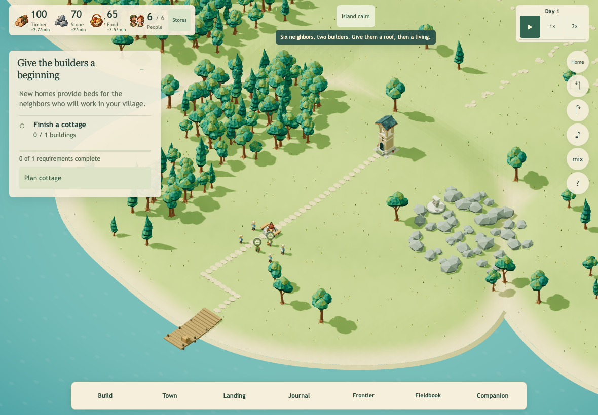
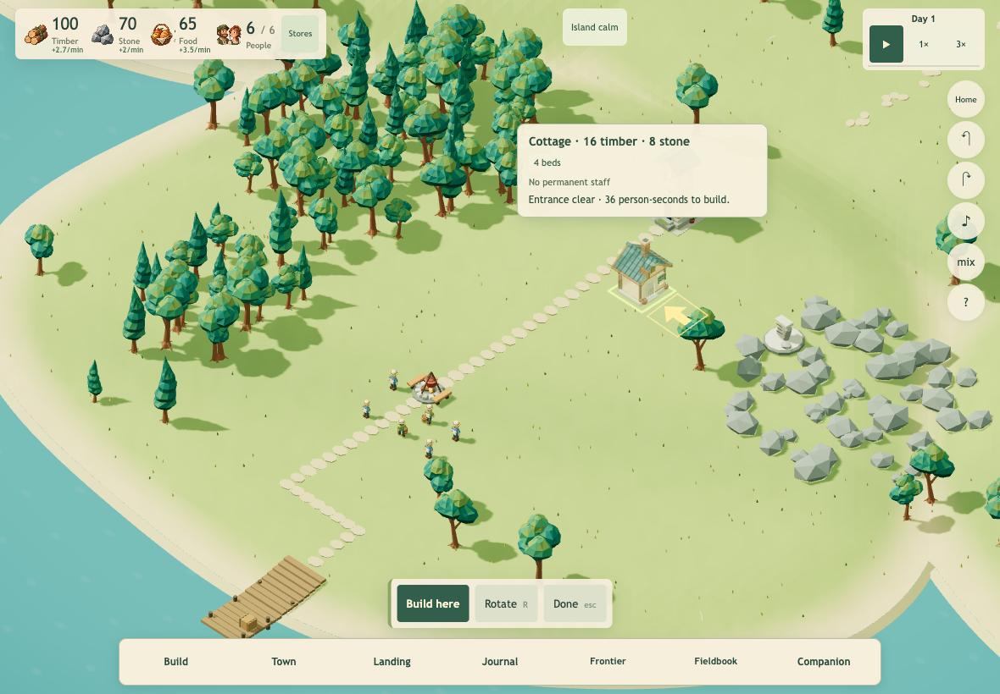

# Wildhaven: readable goals and reliable controls

Release candidate based on `af9d8dc6b93a28eb43e70296fcf5143e26ec992e`. Runtime version: `20261008-clear-island-1`. All 30 JS modules and all styles share this version. Existing first-bread draft PR #153 is separate and unchanged.

## Changes

- One click switches between the seven dock destinations. Journal closes competing books; the dock remains available in Companion. Direct **Stores** sits with resources; the town tab explicitly says **Research**.
- Resources are compact at the left, time controls at the right, and notices in the center. Calm, incoming and active threats use both actual coastal and frontier states. Simultaneous warnings are visible; the status opens the relevant book. Phone rows and panel clearances adapt to the header's measured height.
- Objectives list independently named requirements, completion marks and quantities. The overall count is completed requirements, never a sum of people, goods and service percentages. A short reason and one useful action support each stage. Bread, tools and cloth chains appear in relevant guidance, building descriptions and Stores.
- Placement information follows the projected roof and clears the model, screen edges and camera controls. The 44px confirmation/rotate/cancel controls remain fixed. R/Esc hints remain visible on touch devices; mouse use and touch confirmation continue to work together.
- Wheel units are normalized and zoom gain is proportional. A 100px wheel notch at zoom 32 now targets 24.92, versus 30.5 before. Pinch follows the change in finger span, with existing cancellation/remaining-finger behavior retained.
- Civilian movement no longer requires returning to an occupied tile center. Changed approaches/gates are revalidated, stalled routes retry, and guard arrival ports stay distinct. Worker bubbles are unchanged.
- New arrivals use 192 given names and 64 family names, avoiding occupied spellings and numbered suffixes. Existing named saves and the historical v1 migration sequence retain their identities.
- Automatic Town, inspector and Fieldbook refreshes preserve a pressed native control until click or cancellation. Explicit actions still render immediately. No actions are synthesized or replayed.

## Reproduced failures

Baseline Journal and Town were both visible after clicking Town then Journal; Town's z-index was 4 while Journal had no stacking override. A live Town press across a refresh also disconnected the original button: builder target stayed 2. With the fix, the same held press keeps the button connected and changes 2 → 3 exactly once; releasing elsewhere changes nothing.

Actual movement regressions reproduced an occupied tile-center stall and guard entrance ports only 0.19 world units apart, below their 0.445 spacing. Five new movement assertions fail against the baseline source.

## Verification

- **277/277 Node tests** pass, including historical save migrations, requirement parity across every chapter/specialty, names, gesture continuity, press cancellation and actual movement methods.
- All **30 runtime modules** pass supplemental ESLint checks; `git diff --check` passes. Archive verification passes **2,020 checks / 33 apps / 9 stories**.
- One isolated installed Chrome browser at a time: 1180×820 touch, 820×1180 touch, 390×844 touch and 1440×900 mouse. All 49 dock combinations pass on landscape tablet and desktop; seven source-to-Journal transitions pass on phone and portrait tablet. Each dock button plus Stores works on its first click after refresh in the landscape touch context.
- All four viewports open the 15-node research map and a selected discovery. Stores, cloth workplace destination, threat-status destination, touch preview/cancel, R rotation, fixed controls and model/card separation pass. Preview/cancel preserves resources.
- Native held Town and inspector staffing clicks register once. Fieldbook tab selection survives a controlled simulation advance while pressed. Cancelled presses perform no action. Pause while reading persists across book changes and resumes only on closing; explicit Run while open remains respected.
- Six read-only Companion navigation destinations preserve both the active snapshot and persisted envelope, with Build disabled.
- An explicitly constructed shore fixture uses the actual 9,631-vertex watch-house model. Arrival ports are 1.41 units apart; both guards reach watching within 7 movement seconds. Over 20 presentation seconds they stay dry, legal and separated (minimum 0.46), patrol, and leave the economy unchanged. This is an engineering fixture, not earned gameplay or a performance benchmark.
- An explicitly modified historical campaign save verifies the mature checklist, cloth guidance and simultaneous raid/coastal notice. It is not presented as newly earned play.

Evidence and scripts: [ui-polish-2026-10-08](./ui-polish-2026-10-08/). `candidate.json`, `focused.json`, `advanced.json` and `shore-guards.json` contain results; `runtime-sha256.json` identifies the reviewed source/assets. Scripts expect a loopback server on 14725 with `/baseline/realm/wildhaven` pinned to the base and `/candidate` pointing to current `docs`. Set `WILDHAVEN_PLAYWRIGHT` to an existing Playwright module when needed; no installation is required by this change. Run serially from the repository root.

## Limits

Physical iPad Safari, native hardware keyboard/trackpad behavior, sustained device performance and a long human play session remain unverified. Chrome touch emulation is not a claim of perfect iPad support. Phone wheel measurements are not used as zoom evidence because the chosen pointer location hit the objective; actual world-wheel measurements come from tablet and desktop. No multiplayer backend, native-app rewrite, new art, experimental progress rings or worker-bubble changes are included.
